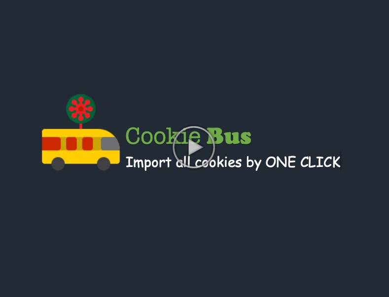
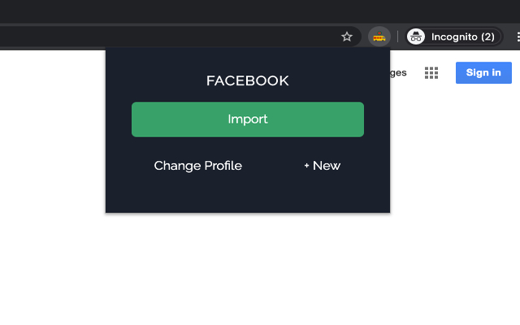
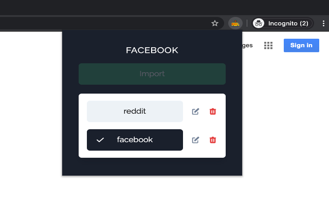
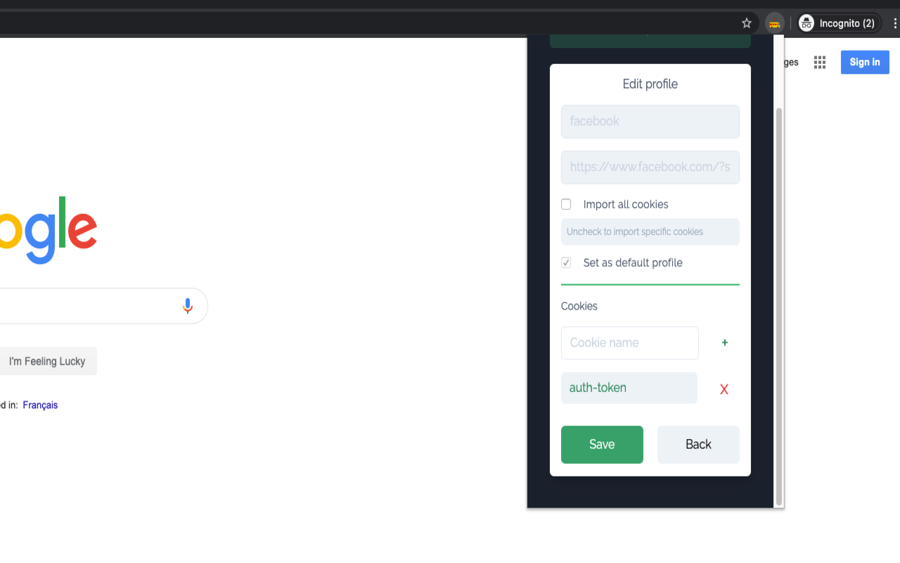
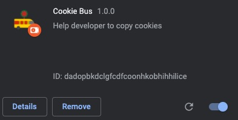
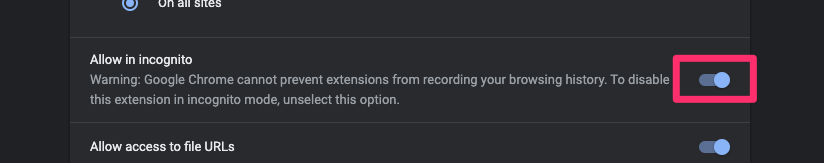

[![Release][release-shield]][release-url]
[![Downloads][downloads-shield]][downloads-url]
[![Stargazers][stars-shield]][stars-url]
[![Forks][forks-shield]][forks-url]
[![Contributors][contributors-shield]][contributors-url]
[![Issues][issues-shield]][issues-url]
[![MIT License][license-shield]][license-url]

<!-- PROJECT LOGO -->
<br />
<p align="center">
  <a href="https://github.com/qiandongyq/cookie-bus">
    
  </a>

  <h3 align="center">Cookie Bus</h3>

  <p align="center">
    Import Cookies from any tabs!
    <br />
    <a href="https://github.com/qiandongyq/cookie-bus/releases/download/1.0.2/cookie-bus-1.0.2.zip"><strong>Download (Version 1.0.2) »</strong></a>
    <br />
    <br />
    <a href="https://github.com/qiandongyq/cookie-bus/issues">Report Bug</a>
    ·
    <a href="https://github.com/qiandongyq/cookie-bus/issues">Request Feature</a>
  </p>
</p>

<!-- TABLE OF CONTENTS -->

## Table of Contents

- [About the Project](#about-the-project)
  - [Screenshots](#screenshots)
  - [Built With](#built-with)
- [Demo](#demo)
- [Getting Started](#getting-started)
  - [Prerequisites](#prerequisites)
  - [Installation](#installation)
- [Usage](#usage)
- [Known Issue](#known-issue)
- [Contributing](#contributing)
- [License](#license)

<!-- ABOUT THE PROJECT -->

## About The Project

**💻 Cookie Bus is an extremely simple One-Click 👍 chrome extension to help developer imports cookies from specific domain to the current tab. It is not a cookie manipulate tool but a tool to reduce the time when dealing with cookies in a different environment.**

## Features

✅ One Click

✅ Import all cookies

✅ Import individual or multiple specific cookies

✅ Multiple profiles support

<!-- Demo -->

## Demo

<a href="https://youtu.be/AEMhlEKemqs">
  
</a>

### Screenshots

One click import



Change profile



Create


Edit



### Built With

- [React](https://reactjs.org/)
- [Tailwindcss](https://tailwindcss.com/)
- [Chrome Api](https://developer.chrome.com/extensions/api_index)
- [Google fonts](https://fonts.google.com/)
- [Eslint](https://eslint.org/)
- [Prettier](https://prettier.io/)

<!-- GETTING STARTED -->

## Getting Started

To get a local copy up and running follow these simple steps.

### Prerequisites

This is an example of how to list things you need to use the software and how to install them.

- npm

```sh
npm install npm@latest -g
```

### Installation

1. Clone the repo

```sh
git clone https://github.com/qiandongyq/cookie-bus
```

2. Install NPM packages

```sh
npm install
or
yarn install
```

<!-- USAGE EXAMPLES -->

## Usage

**Scripts**

- `yarn start` - build css in watch mode and start webpack dev server
- `yarn build` - builds css in production mode (purgecss unused css), build extension to `/release/cookie-bus-1.0.2` folder

**Load extension in Google Chrome**

In [Google Chrome](https://www.google.com/chrome/), open up [chrome://extensions](chrome://extensions) in a new tab. Make sure the `Developer Mode` checkbox in the upper-right corner is turned on. Click `Load unpacked` and select the `/release/cookie-bus-1.0.2` directory in this repository - your extension should now be loaded.



**Load extension in incognito mode**

In extension page, click `Details` on `Cookie Bus` extension, enable the `Allow in incognito` switch



<!-- Known Issue -->

## Known Issue

- None

<!-- CONTRIBUTING -->

## Contributing

Contributions are what make the open source community such an amazing place to be learn, inspire, and create. Any contributions you make are **greatly appreciated**.

1. Fork the Project
2. Create your Feature Branch (`git checkout -b feature/AmazingFeature`)
3. Commit your Changes (`git commit -m 'Add some AmazingFeature'`)
4. Push to the Branch (`git push origin feature/AmazingFeature`)
5. Open a Pull Request

<!-- LICENSE -->

## License

Distributed under the MIT License. See `LICENSE` for more information.

<!-- MARKDOWN LINKS & IMAGES -->
<!-- https://www.markdownguide.org/basic-syntax/#reference-style-links -->

[contributors-shield]: https://img.shields.io/github/contributors/qiandongyq/cookie-bus.svg?style=flat-square
[contributors-url]: https://github.com/qiandongyq/cookie-bus/graphs/contributors
[forks-shield]: https://img.shields.io/github/forks/qiandongyq/cookie-bus.svg?style=flat-square
[forks-url]: https://github.com/qiandongyq/cookie-bus/network/members
[stars-shield]: https://img.shields.io/github/stars/qiandongyq/cookie-bus.svg?style=flat-square
[stars-url]: https://github.com/qiandongyq/cookie-bus/stargazers
[issues-shield]: https://img.shields.io/github/issues/qiandongyq/cookie-bus.svg?style=flat-square
[issues-url]: https://github.com/qiandongyq/cookie-bus/issues
[license-shield]: https://img.shields.io/github/license/qiandongyq/cookie-bus.svg?style=flat-square
[license-url]: https://github.com/qiandongyq/cookie-bus/blob/master/LICENSE.txt
[release-shield]: https://img.shields.io/github/release/qiandongyq/cookie-bus.svg?style=flat-square
[release-url]: https://github.com/qiandongyq/cookie-bus/releases
[downloads-shield]: https://img.shields.io/github/downloads/qiandongyq/cookie-bus/total.svg?style=flat-square
[downloads-url]: https://github.com/qiandongyq/cookie-bus/releases/download/1.0.0/cookie-bus.zip
[version]: 1.0.2
